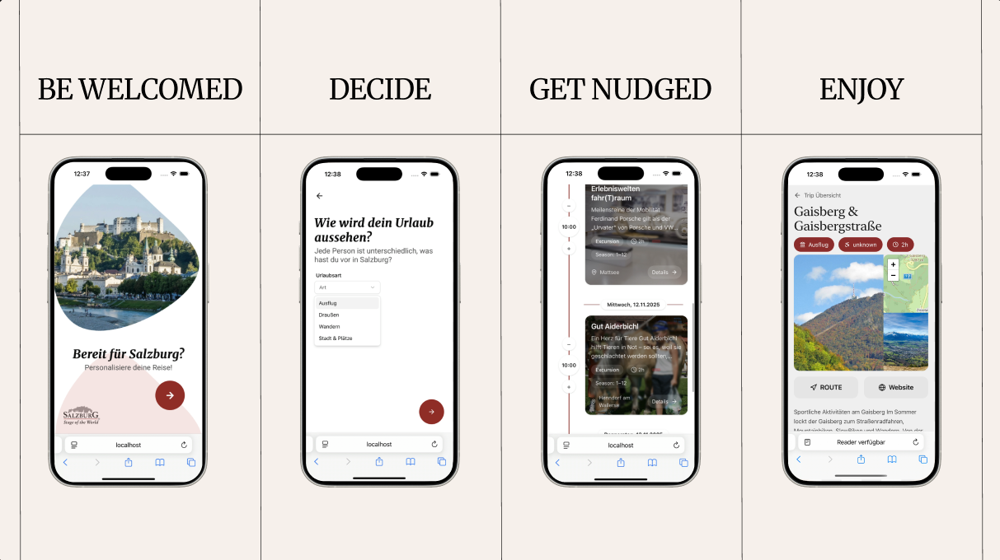

Nudged Visitors enjoy one more attraction.

Allow for an easy way to nudge and assist visitors and tourists of Salzburg to find and plan their days by themselves even before booking their stay or during their stay and maybe even enjoy one more attraction.



## Challenge: Salzburg Card

To run the project, use the following command:

```bash
docker-compose up
```

Make sure to create .env file in apps/cms/.env
See apps/cms/.env.example for reference.

## JSON objects

### TRIP DTO

- userId generated in frontend and persisted in localStorage
- `GET trip?userId=1234`

```json
{
    "planned_visits": [
        {
            "experience": {
                ...
            },
            "start": 12323423,
            "end": 234234234
        }
    ]
}
```

- `POST trip?userId=1234`

```json
{
  "data": {
    "start_date": "2025-11-11T00:00:00.000Z",
    "end_date": "2025-11-19T00:00:00.000Z",
    "experiences": {
      "connect": ["dw9aongvv0ywpmadzp8bq04n", "szg4bby9itglyzylxl4h4umh"]
    }
  }
}
```

### Experience DTO

- `GET filter?startDate=2025-11-08T20:31:27.243Z&endDate=...&categories=..`

#### RESULT

```json
{
    [{}]
}
```
